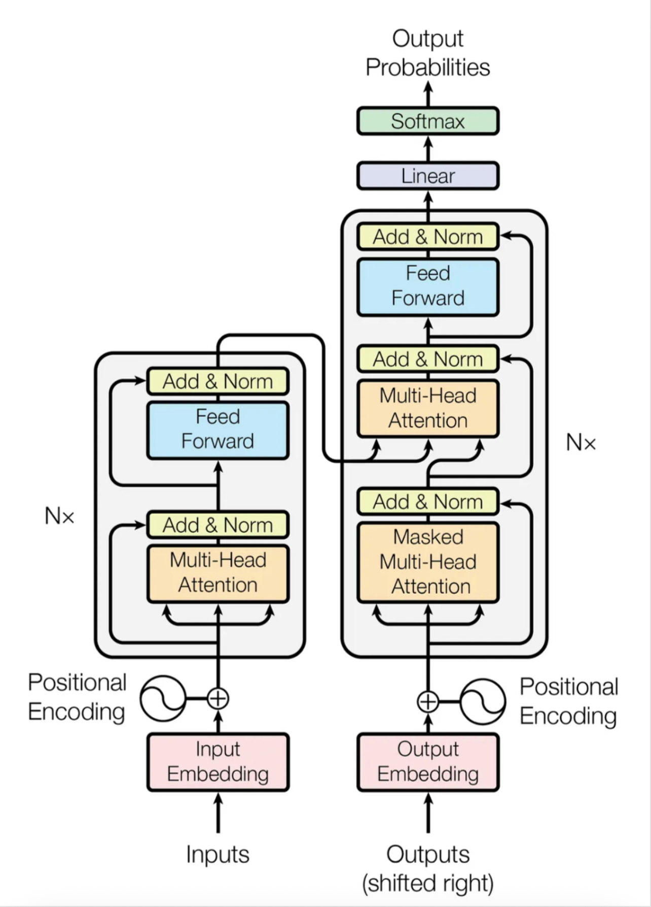

# Transformers (PyTorch)

<p align="center">
  
</p>

A clean encoder–decoder Transformer implemented **from scratch** (no `nn.Transformer`), mirroring the
"Attention Is All You Need" architecture.

**Features**
- Sinusoidal positional encoding
- Multi-Head Attention, Position-wise FFN
- Add & Norm (post-LN)
- Padding + causal masks
- Teacher forcing training loop
- Greedy decoding helper
- Toy task (copy) for quick sanity check

## Quickstart
```bash
git clone https://github.com/piyushsinghoffice/transformers.git
cd transformers
python -m venv .venv && source .venv/bin/activate   # on Windows: .venv\Scripts\activate
pip install -r requirements.txt
python -m examples.toy_train
